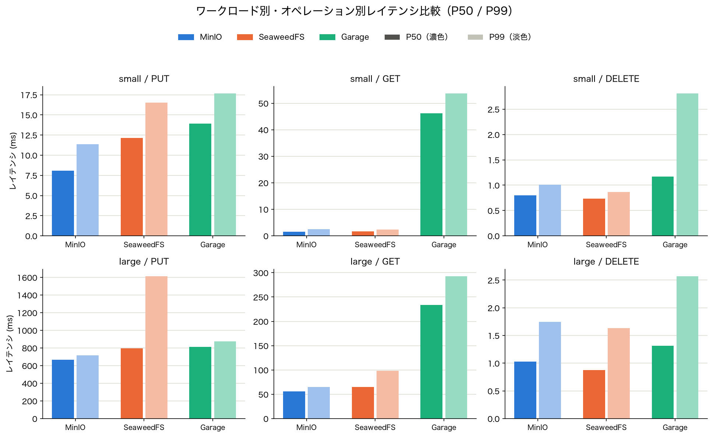
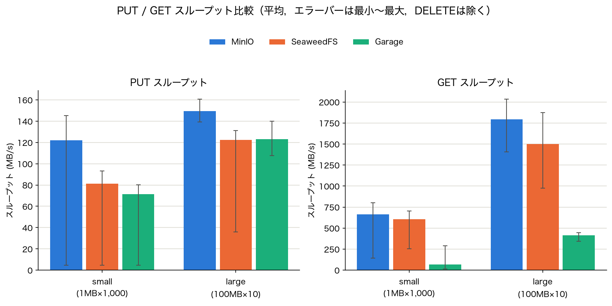
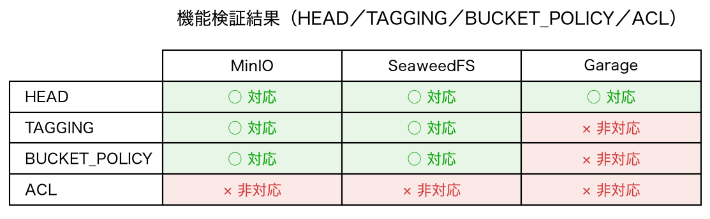

# object-storage-benchmark

S3互換性オブジェクトストレージのベンチマークを行う．
現在行った検証では，MinIOをリファレンスとして，GarageとSeaweedFSを比較した．
その結果，S3互換性および，読み書き等のパフォーマンス，WebUIの使い勝手から，SeaweedFSに軍配が上がった．

## 目的

OSS版MinIOは，2025年10月にDockerイメージの配布が終了され，その後2026年2月にリポジトリがアーカイブされ，公式の保守が完全に終了した．
そこで，他のS3互換性オブジェクトストレージを比較し，移行先を検討する．

## ベンチマーク選定

| 対象 | サービス名 | 概要 | 選定・非選定理由 | リポジトリ |
| :--: | ---------- | ---- | ---------------- | ---------- |
| ○ | MinIO | S3互換オブジェクトストレージのデファクトスタンダード．高性能・高S3互換性を特徴とする | 移行前の現行システムのため，比較基準として選定 | [minio/minio](https://github.com/minio/minio) |
| ○ | SeaweedFS | 小ファイルを数十億件・ペタバイト規模まで効率的に扱える分散オブジェクトストレージ．GoによるS3互換実装 | 開発実績が豊富で今回の規模に適しているため | [seaweedfs/seaweedfs](https://github.com/seaweedfs/seaweedfs) |
| ○ | Garage | 小〜中規模向けの軽量分散オブジェクトストレージ．Rustで実装され低リソースで動作 | 小〜中規模用途に適しており，開発実績が豊富なため | [deuxfleurs-org/garage](https://github.com/deuxfleurs-org/garage) |
| × | Ceph (RGW) | 大規模向けの汎用分散ストレージ．RGWコンポーネントがS3互換APIを提供 | 大規模用途向けで運用が複雑なため | [ceph/ceph](https://github.com/ceph/ceph) |
| × | RustFS | MinIO互換のドロップイン代替を目指すRust実装のS3互換オブジェクトストレージ | 開発中（v1.0.0-alpha）で信頼性の実績が不十分なため | [rustfs/rustfs](https://github.com/rustfs/rustfs) |
| × | JuiceFS | 分散ファイルシステム（バックエンドにオブジェクトストレージを使用）．S3ゲートウェイは補助機能として提供 | S3ゲートウェイがマルチユーザー管理・オブジェクトタグ等に非対応で機能制限が多いため | [juicedata/juicefs](https://github.com/juicedata/juicefs) |

## 実行環境

- MacBook Air M4
- Podman 5.8.1
- Python（uv + pyproject.toml）

## 比較方法

### ツール

自作スクリプト（Polars・boto3使用）

### 実行方式

- 各ストレージを個別にコンテナ起動し，1種類ずつ計測する
- 接続はシーケンシャル（並列化なし）
- ウォームアップなし

### ワークロード

| ワークロード | ファイル形式 | サイズ | 個数 | 操作 | 試行回数 |
| :----------: | :----------: | :----: | :--: | ---- | :------: |
| 小ファイル | Parquet（ランダムバイト） | 1 MB | 1,000 | PUT / GET / DELETE | 3回 |
| 大ファイル | Parquet（ランダムバイト） | 100 MB | 10 | PUT / GET / DELETE | 10回 |

### 指標

| 区分 | 指標 | 計測方法 |
| ---- | ---- | -------- |
| パフォーマンス | スループット (MB/s) | 転送時間から算出（p50 / p99） |
| パフォーマンス | レイテンシ (ms) | 各オペレーションの所要時間（p50 / p99） |
| 機能 | メタデータ操作 | boto3 で HEAD / タグ付け等を検証 |
| 機能 | アクセス権設定 | バケットポリシー・ACLの動作を確認 |
| 運用 | UI の見やすさ | 管理コンソールを目視評価（8項目．[検証項目の定義](docs/benchmark_spec.md#4-webui-目視検証)） |

#### WebUI 評価項目

管理コンソールは自動計測できないため，以下の8項目をブラウザで目視確認し `docs/webui_results.csv` に記録する．

| 項目 | 確認内容 | 評価 |
| ---- | -------- | ---- |
| アクセス可否 | UIにアクセスできるか（ログイン画面またはダッシュボードが表示される） | Pass / Fail |
| バケット一覧 | 作成済みバケットが一覧表示されるか | Pass / Fail |
| オブジェクト閲覧 | バケット内のオブジェクト（キー・サイズ）が一覧表示されるか | Pass / Fail |
| アップロード | UIからファイルをアップロードできるか | Pass / Fail |
| ダウンロード | UIからファイルをダウンロードできるか | Pass / Fail |
| バケットポリシー設定 | UIからバケットポリシーを設定・参照できるか | Pass / Fail / N/A |
| メトリクス | スループット・リクエスト数などの監視情報が表示されるか | Pass / Fail / N/A |
| 使いやすさ | 操作感・情報密度の主観評価（3段階） | 良い / 普通 / 悪い |

検証手順は各ストレージを個別に起動し，`./scripts/seed_ui_data.sh {minio|seaweedfs|garage}` で
サンプルオブジェクトを投入してから確認する．管理UIの提供形態は3者で大きく異なる．

| ストレージ | 管理UI | 備考 |
| ---------- | ------ | ---- |
| MinIO | `http://localhost:9001` | OSS版は2025年5月以降オブジェクトブラウザのみ．管理機能は `mc` CLIへ移行 |
| SeaweedFS | `http://localhost:23646` | `weed admin` は別プロセス．`./scripts/start_seaweedfs_admin.sh` で起動する |
| Garage | なし | 公式コンソールを同梱しない．管理はCLIとAdmin API (`:3903`) |

### 結果出力

- 計測結果：CSV
- 可視化：Pythonスクリプト（matplotlib等）でグラフ生成

### 計測環境の注意

ストレージコンテナとベンチマークスクリプトは同一ホスト上で動作する（Podman仮想ネットワーク経由）．物理NICの帯域制限を受けないため，絶対値は本番環境と異なるが，3ストレージ間の相対比較は有効．

## 結論

`results/trial2/`（コンテナイメージのタグを固定して取得）を正とし，グラフ・集計は `src/analyze.py` の出力（`docs/figures/`）を用いる．

### 1. 性能比較

#### レイテンシ（ms，P50 / P99）

| ワークロード | オペレーション | MinIO | SeaweedFS | Garage |
| :----------: | :-------------: | ----: | --------: | -----: |
| small | PUT | 8.3 / 15.6 | 13.0 / 21.5 | 13.2 / 33.5 |
| small | GET | 1.8 / 5.4 | 2.0 / 3.4 | 4.2 / 7.7 |
| small | DELETE | 0.8 / 1.5 | 0.9 / 1.2 | 1.3 / 3.6 |
| large | PUT | 662.5 / 900.2 | 925.9 / 1269.2 | 1048.7 / 1161.3 |
| large | GET | 75.9 / 109.4 | 92.4 / 128.0 | 295.4 / 405.3 |
| large | DELETE | 1.2 / 3.6 | 1.1 / 2.3 | 1.4 / 2.7 |

#### スループット（MB/s，平均）

DELETEはボディ転送がなくスループットの評価対象にならないため（`elapsed_ms` に対して `size_bytes` が実質ゼロで指標として意味を持たない），PUT / GETのみを比較する．

| ワークロード | オペレーション | MinIO | SeaweedFS | Garage |
| :----------: | :-------------: | ----: | --------: | -----: |
| small | PUT | 117.2 | 76.7 | 74.6 |
| small | GET | 544.3 | 484.6 | 233.0 |
| large | PUT | 149.0 | 108.2 | 96.5 |
| large | GET | 1323.3 | 1091.5 | 330.6 |

転送を伴うPUT / GETは全ワークロードでMinIOが最速で，SeaweedFSが次点にMinIOへ比較的近い値を維持している．唯一の例外はlarge DELETEで，ここだけはSeaweedFSがMinIOを上回る（P50 1.1 ms 対 1.2 ms，P99 2.3 ms 対 3.6 ms）．ただしDELETEは3ストレージとも数ms以内に収まっており，選定を左右する差ではない．Garageは総じて最も遅く，特にlarge GETはP50レイテンシで見るとMinIOの約4倍（295.4 ms 対 75.9 ms）の時間がかかっている．

### 2. S3 API 機能対応表

| 機能 | MinIO | SeaweedFS | Garage |
| ---- | :---: | :-------: | :----: |
| HEAD | ○ | ○ | ○ |
| TAGGING | ○ | ○ | × |
| BUCKET_POLICY | ○ | ○ | × |
| ACL | × | × | × |

MinIOとSeaweedFSはHEAD・TAGGING・BUCKET_POLICYに対応する（ACLは両者とも非対応）．
Garageは TAGGING・BUCKET_POLICY・ACL のいずれでも `An error occurred (NotImplemented) ... Unimplemented action` を返し，明示的に未実装であることを示している．
これはGarage v1.0.1・v2.3.0の両バージョンで同一の挙動であり，バージョンの問題ではなく実装方針（これらのAPIをサポートしない方針）とみられる．

なお，ACLはAWS S3自体でも非推奨（バケットポリシーへの移行が推奨）であり，3ストレージとも非対応のため判断材料としての重みは低い．アクセス制御が必要な場合はバケットポリシーで代替できる．

### 3. WebUI評価表

| 項目 | MinIO | SeaweedFS | Garage |
| ---- | :---: | :-------: | :----: |
| アクセス可否 | Pass | Pass | ---（公式コンソール非同梱） |
| バケット一覧 | Pass | Pass | --- |
| オブジェクト閲覧 | Pass | Pass | --- |
| アップロード | Pass | Pass | --- |
| ダウンロード | Pass | Pass | --- |
| バケットポリシー設定 | Fail（CLIのみ対応） | Pass（非常に良い） | ---（Admin APIで代替） |
| メトリクス | Fail（CLIのみ対応） | Pass（非常に良い） | ---（Admin APIの `/metrics` で代替） |
| 使いやすさ | 良い（モダンな見た目） | 普通（シンプルな見た目） | ---（管理はCLIとAdmin APIのみ） |

Garageは公式の管理コンソールを同梱せず，管理はCLIとAdmin API（`:3903`）で行う仕様のため上記項目は評価対象外（`---`）とした．

### 4. 移行先の推奨と判断理由

**SeaweedFSを移行先として推奨する．**

- **性能**: 転送を伴うPUT / GETではMinIOが最速だが，SeaweedFSはレイテンシ・スループットともにMinIOに比較的近く，実用上許容できる差にとどまっている（large DELETEに限ればSeaweedFSがMinIOを上回る）．一方Garageは全項目で最も遅く，特にlarge GETはMinIOの約4倍のレイテンシがあり，大容量オブジェクトを扱う用途では明確な性能劣化となる．
- **機能**: SeaweedFSはHEAD・TAGGING・BUCKET_POLICYのすべてに対応し，MinIOと同等のS3 API互換性を持つ．Garageはこれらのうちタグ付けとバケットポリシーが未実装であり，`Unimplemented action` として明示的に非対応が返るため，タグベースの運用やバケット単位のアクセス制御を前提とする既存の運用フローをそのまま移行できない．
- **UI**: SeaweedFSは `weed admin`（別プロセスの管理UI）でバケットポリシー設定・メトリクス表示の両方に対応し，目視評価でも良好（バケットポリシー設定・メトリクスともに「非常に良い」）であった．Garageは管理UIを同梱せず，全操作をCLIとAdmin APIで行う必要がある．

**重要な含意**: 今回の移行動機はMinIOのEOL（Dockerイメージ配布終了・リポジトリアーカイブ）だが，UIの観点では現行のOSS版MinIOコンソール自体が2025年5月以降オブジェクトブラウザのみとなり，バケットポリシー設定とメトリクス表示はすでにCLI専用になっている．つまり「現行と同等のUI」を移行先に求める前提自体が成り立たない．この基準で見ると，バケットポリシー設定・メトリクス表示の両方をUIから行えるSeaweedFSの管理UIは，現行のMinIO OSS版よりもむしろ機能面で上回っている．

**Garageを推奨しない理由**: 性能で全項目最下位（特にlarge GETが顕著）であることに加え，タグ付け・バケットポリシーが未実装で運用上必要になりやすい機能が欠けており，管理UIも同梱しない．軽量・低リソースという特性はあるが，本プロジェクトが必要とする機能要件を満たさないため見送る．

**MinIO継続を推奨しない理由**: 性能・機能・現行踏襲の観点では最も優れているが，そもそも移行の起点がMinIO OSS版のEOL（保守終了）であるため選択肢から外れる．

ACLは3ストレージとも非対応だが，AWS S3自体で非推奨でありバケットポリシーで代替可能なため，上記の判断に影響しない．

### 5. 計測条件の制約

本結論の妥当範囲は以下の条件下に限られる．

- シングルノード構成．ストレージコンテナとベンチマーククライアントは同一ホスト上で動作し，物理NICの帯域制限を受けない
- シーケンシャル実行（並列度1），ウォームアップなし
- 計測は `results/trial2/` を使用．コンテナイメージのタグを固定して取得した
  （MinIO `RELEASE.2025-09-07T16-13-09Z` / SeaweedFS `4.45` / Garage `v2.3.0`）
- SeaweedFSの管理UI（`weed admin`）は公式wikiに "This is still work in progress" の注記があり，本結論の評価時点の実装を反映したものである
- DELETEはボディ転送がないためスループットは評価対象外とし，レイテンシのみで比較した
